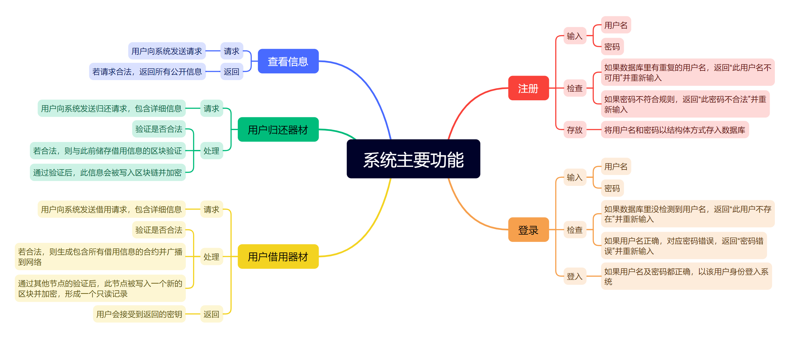

# Digital-signature-borrowing-platform

Tsinglan Digital Signature System for Equipment Borrowing is a project that
aims to solve the problems of device borrowing among students and teachers at
Tsinglan School. The project uses digital signature and blockchain technologies
to create and verify online contracts for borrowing science equipments and
devices, and to provide a secure, transparent, and convenient way to manage the
borrowing process.

## Features

1. Contracts generation based on user input  
1. Blockchain writing  
1. Contract confirmation  
1. Return confirmation  
    

## Installation

1. find a suitable place, then run:

    ```sh
    git clone git@github.com:wusitee/Digital-signature-borrowing-platform.git
    ```

1. Then, `cd` to the `Digital-signature-borrowing-platform\` and run:

    ```sh
    virtualenv venv
    ```

1. Activate `venv`

    On windows, run:

    ```sh
    venv\Scripts\activate
    ```

    On Linux or MacOS, run:

    ```sh
    source venv/bin/activate
    ```

1. Install the requirements by running:

    ```sh
    python -m pip install -r requirements.txt
    ```

## Requirement

- Python 3
- virtualenv
